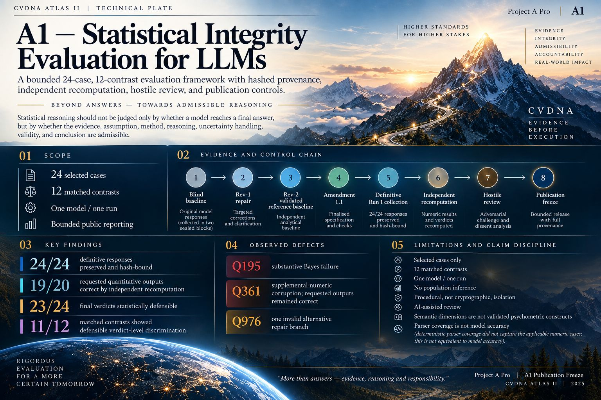

# A1 Statistical-Integrity Benchmark



## Publication status

**A1 V1.2.1 FINAL — PUBLISHED WITH QUALIFICATION** for bounded portfolio/research use after controlled cross-model reconciliation and a final Claude model-assisted challenge. V1.2, the V1.2.1 release candidate, and the frozen Amendment 1.1 baseline remain preserved.

A1 is a compact, AI-assisted evaluation artifact comprising 24 selected statistical-integrity cases arranged as 12 designed matched contrasts. It combines preserved prompt/response provenance, frozen scoring and run-protocol governance, clean replay, failure localization, separated model-assisted challenge, hostile publication review, and explicit claim controls.

This release does **not** establish representative model accuracy, universal statistical competence, contamination-free execution, psychometric validity, enterprise deployment performance, or superiority to other benchmarks.

## Recorded run

- Model alias: OpenAI `gpt-5.6-luna`
- Reasoning setting: `low`
- Responses preserved: 24/24
- Collection: one reported fresh projectless task per case, in two blocks
- Frozen deterministic parser: 0/20 numeric-applicable cases evaluated; this is parser coverage, **not 0% accuracy**
- Attributed manual/analytical recomputation: 19/20 applicable cases returned all requested numeric values correctly
- Descriptive matched contrasts: 11/12 had defensible verdict-level discrimination in both arms

See `RESULTS.md`, `LIMITATIONS.md`, and `evidence/FINAL_ADJUDICATION.md` before quoting any result.

## V1.2 external-challenge hardening

A public question from Nick Hart prompted an explicit survivor/selection-bias gate. A public observation from Fábio Borges prompted a stronger observable reasoning-evidence audit. These are credited external challenge inputs, not independent validation.

The new controls verify the definitive case/response/provenance universe, preserve declared retries and failure outcomes, prohibit outcome-based exclusion, hash-bind selected attempts, and separate observable evidence lineage from inaccessible hidden chain-of-thought. Hostile cases fail closed.

Run 1 shows no observed attrition inside its 24-case definitive universe. A1 still does **not** claim that its purposive cases represent a population or that the complete earlier pilot/corrective-task universe can be reconstructed. The V1.2 hardening disposition is therefore **CONDITIONAL PASS**.

Run:

```text
python scripts/run_v1_2_hardening.py
python scripts/publication_gate.py
```

Read `evidence/EXTERNAL_CHALLENGE_HARDENING_V1_2.md`, `evidence/CLAIM_LEDGER_V1_2.csv`, and `reviews/codex/CODEX_ADVERSARIAL_REVIEW_V1_2.md` before client use.

## V1.2.1 separated review and reconciliation

The V1.2 candidate was supplied through two separated review lanes. Gemini received blind case, response and provenance evidence without answer keys, scores or prior conclusions. An Abacus AI Agent received the complete frozen candidate for reproduction and hostile claim review. The Abacus platform did not disclose the underlying model identity, so this repository does not claim a verified Kimi K3 backend.

Both raw reports are preserved unchanged with their actual received-file hashes. Gemini found the genuine Q195 failure but also made its own Q195 arithmetic error, incorrectly labelled Q795, and missed Q361's supplemental error. Abacus reproduced 46/46 tests and found no successful bypass, but its self-reported file hash did not match the received report. These nonconformities are retained rather than averaged away.

V1.2.1 adds six publication-reconciliation controls to the preserved 46 benchmark and hostile-hardening tests, for **52/52 automated controls** in the final release. The new controls govern reviewer receipts and public claims; they do not alter the benchmark responses, reference answers or adjudication.

## Final Claude challenge

Claude returned `CONDITIONAL GO` with no blocking finding for the bounded portfolio/research scope. Its raw report is preserved unchanged. Controlled reconciliation accepted the disposition but corrected five overstatements: an overbroad instruction to remove model identifiers, incorrect attribution of the 52-test result to `run_manifest.json`, an impossible assurance against all misinterpretation, overly broad “model performance” and “all evidence” wording, and an unsupported 98% confidence figure.

The controlling publication statement is:

> A1 V1.2.1 is a bounded statistical-integrity evaluation and portfolio demonstration based on 24 purposively selected cases. Its preserved evidence exposes both successful responses and material failures, including Q195, while 52 automated controls test replay, provenance, hostile conditions and publication claims. The results apply only to the documented case corpus and run; they do not establish population performance, deployment readiness, independent human validation or institutional certification.

See `evidence/CLAUDE_FINAL_GO_RECONCILIATION.md` before quoting Claude's disposition.

The reconciled outcome is **CONDITIONAL GO** for this bounded portfolio/research demonstration only. It is not independent human validation, institutional certification, population benchmarking or deployment-performance evidence. Read `evidence/CROSS_MODEL_REVIEW_RECONCILIATION_V1_2_1.md` before quoting the review outcome.

## Repository map

- `data/`, `src/`, `tests/`, `config/`, `schemas/`, `scripts/`: unchanged Amendment 1.1 processor materials
- `baseline/`: preserved blind, Rev-1, and Rev-2 reference provenance
- `runs/run1/`: complete post-Amendment Run 1 evidence package contents
- `reviews/abacus/`: earlier attributed AI-assisted statistical review
- `reviews/astra/`: attributed hostile methodological/publication review
- `reviews/gemini_lane_a/`: preserved blind methodological review and received-file hash
- `reviews/abacus_lane_b/`: preserved technical/hostile review, declaration and received-file hashes
- `reviews/claude_final_gate/`: preserved final-GO model report and received-file hash
- `evidence/`: evidence chain, hashes, replay results, adjudication, and publication-scope controls
- `runs/run1/hardening_v1_2/`: machine-readable survivor-selection and observable-lineage audit results

## Citation boundary

Describe A1 as a selected-case evaluation framework and portfolio artifact. Do not describe it as a validated population benchmark or a measure of general model competence.

## Public-release note

Public-release note: this repository is a publication-safe derivative of the frozen evidence package. Compiled Python caches and local filesystem identifiers were excluded/redacted for privacy and security. V1.2.1 adds review and reconciliation evidence plus bounded wording; the underlying benchmark evidence, statistical results, adjudication and source logic were not altered. Historical freeze hashes are retained in the provenance record.
